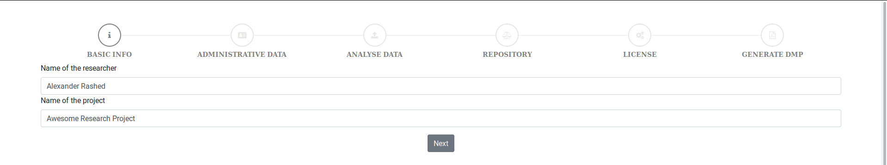
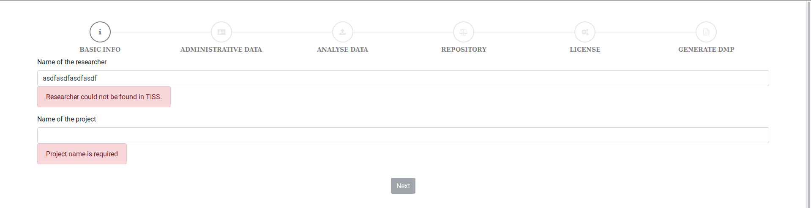
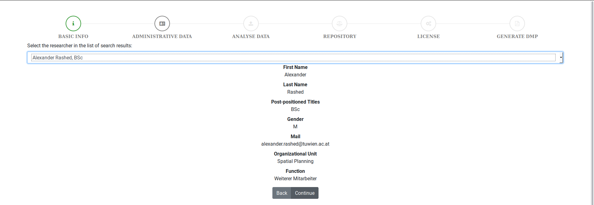
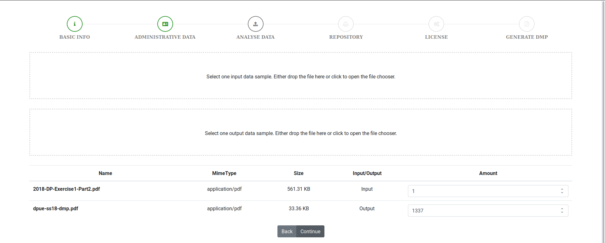
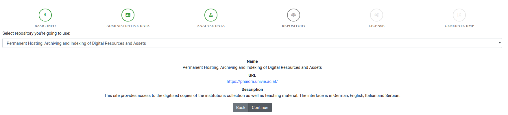
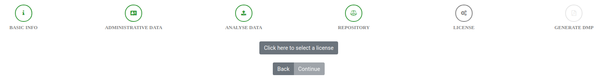
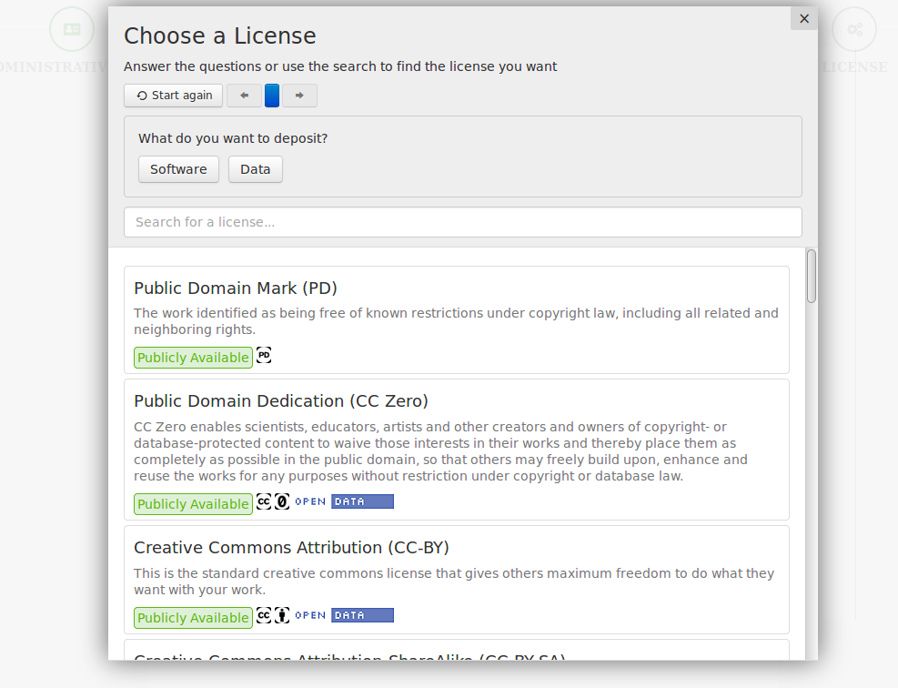
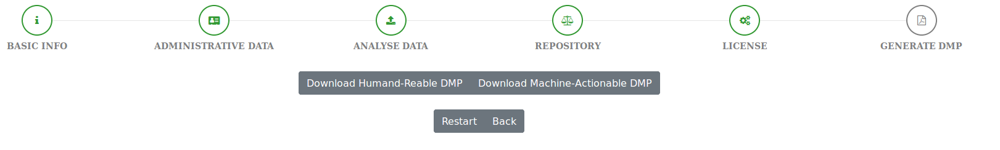

# 188.475 - Digital Preservation - SS18 - Lab 1.2

- Georg Hagmann, 01226641
- Alexander Rashed, 01325897

#### Description

This frontend application allows to easily create a human-readable as well as a machine-actionable data management plan.
It is completely client-side (no data is sent to any server). The application is realized as an Angular 5 application. Docker is used for producing a docker 
container suitable for running on multiple OS. The program is written in Typescript, various plugins have been used for different purposes (e.g. creating a pdf).

##### Workflow
1. The user enters his name and the name of the project.
   
   Both data is mandatory and the researcher has to be found in TISS.
   
2. Afterwards the researcher has to be selected (as there can be several search results returned by the TISS API).
   
3. Now the reference data is selected. Two areas are displayed to drop and input and an output file.
   When a drop area is clicked, the filechooser opens. 
   
   The mime-type detection first checks for magic numbers (using the [file-type javascript library](https://github.com/sindresorhus/file-type)).
   As lots of file formats do not have any magic numbers, we use a fallback mechanism checking the file extensions (using the [mime-types javascript library](https://github.com/jshttp/mime-types)).
4. The previously selected reference output as well as the location of the user are used to find suiting repositories.
   The user's location is handed over by the browser (the user has to agree), otherwise the default (Austria) is used.
   
 5. The next step is the license selector. The user clicks on the button to open the filechooser. 
  
  Afterwards the license selector opens and the user doubleclicks on one of the displayed licenses or clicks through the selection process. In this process the tool
  asks the user various questions regarding the data or software the license is picked for and determines a suitable license based on the answers of the user. 
 6. The last step does not take any additional input from the user, but offers both the machine-readable and the human-readable dmp as downloads.
 
  When the user clicks on one of the download buttons, the download gets started.
  

##### OpenDOAR
The API referenced in the description is deprecated and will be discontinued in May 2018. Therefore the [new API](http://v2.opendoar.sherpa.ac.uk/api.html) (which is currently in beta) was used.
When calling the API, we restrict the country to match the user's country. 
We are mapping the mime-types to OpenDOAR repository types (as described below), but the new API does not provide the possibility to filter for specific repository types (also the documentation is basically non-existent).
Therefore we have to filter the result (to only contain repositories of the correct type) on the client side. 
The new API also has a bug, such that the result has to be limited to 30 results (otherwise the API returns an internal error - 500).
The missing server-side repository-type filtering in combination with the enforced result limit can cause that there are less than 3 remaining repositories left to choose from.

##### JSON-LD

For the creation of the machine-readable DMP five vocabularies have been used:
The Dublin Core elements (http://purl.org/dc/elements/1.1/)
The Dublin Core Metadata terms (http://purl.org/dc/terms/).
Friend of a Friend (FOAF) (http://xmlns.com/foaf/0.1/)
The Preservation Metadata: Implementation Strategies (PREMIS) (http://www.loc.gov/premis/rdf/v1#")

Suitable fields have been introduced by us to ensure better clarity and structure of the document.
FOAF, DC, DCTERMS and PREMIS have been chosen because they are widespread and accepted vocabularies for their respective fields.

##### Mime-Type Mapping
- `application/pdf` - `journal_articles`, `unpub_reports_and_working_papers`, `conference_and_workshop_papers`, `theses_and_dissertations`
- `application/vnd.amazon.ebook` - `books_chapters_and_sections`
- `application/epub+zip` - `books_chapters_and_sections`
- `application/json` - `datasets`
- `text/csv` - `datasets`
- `application/x-7z-compressed` - `datasets`
- `application/zip` - `datasets`
- `application/x-bzip` - `datasets`
- `application/x-bzip2` - `datasets`
- `application/x-tar` - `datasets`
- `application/x-rar-compressed` - `datasets`
- `image/gif` - `multimedia_and_audio_visual`
- `image/x-icon` - `multimedia_and_audio_visual`
- `image/jpeg` - `multimedia_and_audio_visual`
- `image/png` - `multimedia_and_audio_visual`
- `image/svg+xml` - `multimedia_and_audio_visual`
- `image/tiff` - `multimedia_and_audio_visual`
- `image/webp` - `multimedia_and_audio_visual`
- `video/x-msvideo` - `multimedia_and_audio_visual`
- `video/mpeg` - `multimedia_and_audio_visual`
- `video/ogg` - `multimedia_and_audio_visual`
- `video/webm` - `multimedia_and_audio_visual`
- `video/3gpp` - `multimedia_and_audio_visual`
- `video/3gpp2` - `multimedia_and_audio_visual`
- `application/ogg` - `multimedia_and_audio_visual`
- `audio/ogg` - `multimedia_and_audio_visual`
- `application/octet-stream` - `software`
- `application/javascript` - `software`
- `application/ecmascript` - `software`
- `application/java-archive` - `software`
- `application/typescript` - `software`
- `application/x-sh` - `software`
- `application/x-csh` - `software`


##### Possible Improvements
- As soon as the new OpenDOAR API supports defining a filter on the repository-type, this should be used (and the client side filtering should be removed).
- As soon as the new OpenDOAR API allows not setting the `limit` filter, it should be removed.
- The mime-type detection could also implement `shebang` parsing (f.e. `!/bin/env python`) or some kind of programming language syntax-detection.
- Add even more mime-type to repository-type mappings.

#### Discussion

The difference between manually and automatically generated DMP: 

The generated DMP has a lot less information in it. The information that is in it is on the other hand a lot more precise, identifiable and machine-actionable. 
The manually created DMP needs a human to interpret the sections of the DMP and the given answers. Since most answers are free-text-fields in the manual DMP or 
follow only a very rudimentary structure/schema, it is highly unlikely that a machine can sucessfully interpret the data. In the generated DMP, especially the JSON-LD, 
this is easily possible. 

Which DMP sections can be automated and which will be always completed manually:

It is fairly easy to automatically generate the sections of the DMP where there is a limit on the possible answers. E. g. if a given author must be at the TU, it is easily possible 
to automatically get the data associated with a name/orcID, etc.. For questions where there is no natural limit one can of course limit the options available to the DMP-author, e.g. 
only allowing the author to choose between a few different, predetermined options. This is however a trade-off between greater capacity for automation and fewer flexibility for authors,
 researchers, etc. to adapt the DMP to their respective conditions. If open-ended questions (e.g. "What is the long-term preservation plan for the dataset?") are kept in the DMP, it is 
 impossible to automatically create and process these fields. 


#### GitHub

The code of the application and all other material can be found in the following GitHub-Repository: https://github.com/alexrashed/tu-dpue-lab2-ss18


#### Execute

If you don't want to use the docker setup, follow these steps to start a local development server:
```bash
npm install
npm start # don't use ng serve (as this does not automatically configure the API proxy configuration)
```

#### Docker

- Build the image:
  ```bash
  docker build --tag dpue .
  ```
- Execute the script (and mount the folder where you want to store the results at `/usr/src/app/output`):
  ```bash
  docker run --rm -p80:80 dpue
  ```
- Go to [localhost](http://localhost:80).

#### License of this work: [MIT](https://opensource.org/licenses/MIT)
