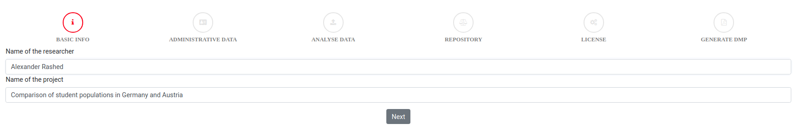
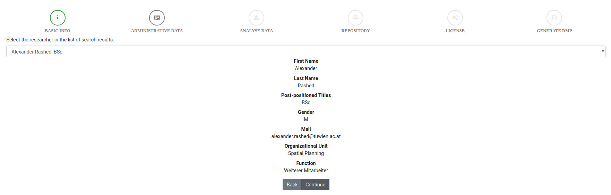
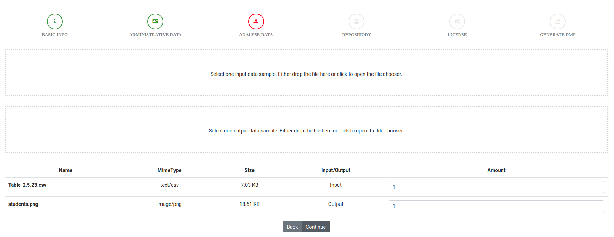

# 188.475 - Digital Preservation - SS18 - Lab 1.2

- Georg Hagmann, 01226641
- Alexander Rashed, 01325897

**TODO GEORG:**
- **Describe license selection**
- **Describe dmp creation**
- **Add screenshots / steps to the workflow description**

#### Description

This frontend application allows to easily create a human-readable as well as a machine-actionable data management plan.
It is completely client-side (no data is sent to any server).

##### Workflow
1. The user enters his name and the name of the project.
   
   Both data is mandatory and the researcher has to be found in TISS.
   
2. Afterwards the researcher has to be selected (as there can be several search results returned by the TISS API).
   
3. Now the reference data is selected. Two areas are displayed to drop and input and an output file.
   When a drop area is clicked, the filechooser opens. 
   
   The mime-type detection first checks for magic numbers (using the [file-type javascript library](https://github.com/sindresorhus/file-type)).
   As lots of file formats do not have any magic numbers, we use a fallback mechanism checking the file extensions (using the [mime-types javascript library](https://github.com/jshttp/mime-types)).
4. The previously selected reference output as well as the location of the user are used to find suiting repositories.
   The user's location is handed over by the browser (the user has to agree), otherwise the default (Austria) is used.
   

##### OpenDOAR
The API referenced in the description is deprecated and will be discontinued in May 2018. Therefore the [new API](http://v2.opendoar.sherpa.ac.uk/api.html) (which is currently in beta) was used.
When calling the API, we restrict the country to match the user's country. 
We are mapping the mime-types to OpenDOAR repository types (as described below), but the new API does not provide the possibility to filter for specific repository types (also the documentation is basically non-existent).
Therefore we have to filter the result (to only contain repositories of the correct type) on the client side. 
The new API also has a bug, such that the result has to be limited to 30 results (otherwise the API returns an internal error - 500).
The missing server-side repository-type filtering in combination with the enforced result limit can cause that there are less than 3 remaining repositories left to choose from.

##### Mime-Type Mapping
- `application/pdf` - `journal_articles`, `unpub_reports_and_working_papers`, `conference_and_workshop_papers`, `theses_and_dissertations`
- `application/vnd.amazon.ebook` - `books_chapters_and_sections`
- `application/epub+zip` - `books_chapters_and_sections`
- `application/json` - `datasets`
- `text/csv` - `datasets`
- `application/x-7z-compressed` - `datasets`
- `application/zip` - `datasets`
- `application/x-bzip` - `datasets`
- `application/x-bzip2` - `datasets`
- `application/x-tar` - `datasets`
- `application/x-rar-compressed` - `datasets`
- `image/gif` - `multimedia_and_audio_visual`
- `image/x-icon` - `multimedia_and_audio_visual`
- `image/jpeg` - `multimedia_and_audio_visual`
- `image/png` - `multimedia_and_audio_visual`
- `image/svg+xml` - `multimedia_and_audio_visual`
- `image/tiff` - `multimedia_and_audio_visual`
- `image/webp` - `multimedia_and_audio_visual`
- `video/x-msvideo` - `multimedia_and_audio_visual`
- `video/mpeg` - `multimedia_and_audio_visual`
- `video/ogg` - `multimedia_and_audio_visual`
- `video/webm` - `multimedia_and_audio_visual`
- `video/3gpp` - `multimedia_and_audio_visual`
- `video/3gpp2` - `multimedia_and_audio_visual`
- `application/ogg` - `multimedia_and_audio_visual`
- `audio/ogg` - `multimedia_and_audio_visual`
- `application/octet-stream` - `software`
- `application/javascript` - `software`
- `application/ecmascript` - `software`
- `application/java-archive` - `software`
- `application/typescript` - `software`
- `application/x-sh` - `software`
- `application/x-csh` - `software`


##### Possible Improvements
- As soon as the new OpenDOAR API supports defining a filter on the repository-type, this should be used (and the client side filtering should be removed).
- As soon as the new OpenDOAR API allows not setting the `limit` filter, it should be removed.
- The mime-type detection could also implement `shebang` parsing (f.e. `!/bin/env python`) or some kind of programming language syntax-detection.
- Add even more mime-type to repository-type mappings.


#### Execute

If you don't want to use the docker setup, follow these steps to start a local development server:
```bash
npm install
npm start # don't use ng serve (as this does not automatically configure the API proxy configuration)
```

#### Docker

- Build the image:
  ```bash
  docker build --tag dpue .
  ```
- Execute the script (and mount the folder where you want to store the results at `/usr/src/app/output`):
  ```bash
  docker run --rm -p80:80 dpue
  ```
- Go to [localhost](http://localhost:80).

#### License of this work: [MIT](https://opensource.org/licenses/MIT)
